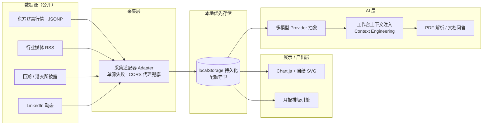

<div align="center">

# 🛰️ 市场情报工作台 · Market Intelligence Workbench

**一个零后端、可离线运行的海外市场情报工作台 —— 把行业雷达、竞品监测、财报解析、月报产出与 AI 助手，收拢进一个单文件 HTML。**

[](https://developer.mozilla.org/)
[](https://www.chartjs.org/)
[](https://mozilla.github.io/pdf.js/)
[](https://platform.openai.com/)
[](https://pages.github.com/)
[](#)

🔗 **[🚀 在线体验 Demo](https://hhhalen-yoyo.github.io/market-intel/)**

</div>

---

## ✨ 这是什么

> 把"多渠道、碎片化、被动式"的外部情报获取，重做成一个**主动汇聚、AI 辅助、可持续沉淀**的工作台。

我在海外市场实习时，每天都要从搜索引擎、LinkedIn、行业媒体、交易所披露平台、新闻客户端里逐个搜集行业动态与竞品信息 —— 这个痛点不只存在于市场岗，运营、产品、战略、销售支持等岗位都需要持续跟踪外部信息。这个工作台就是为了解决这个问题而生的：**让信息自动汇聚，人只做判断。**

---

## 🎯 核心特性

- 🔭 **行业雷达** — 聚合行业媒体 RSS 与新闻中心，按政策 / 招投标 / 竞品 / 行业动态 / 财报 五类自动分类。
- 👀 **竞品监测** — 跟踪竞品 LinkedIn 动态、官网更新与公开披露，变化自动留痕。
- 📈 **财报解析** — 一键拉取友商公开财报，PDF 经 `pdf.js` 解析后支持上传与基于内容的问答（RAG 雏形）。
- 🤖 **林洋 Agent（AI 助手）** — 将工作台数据作为上下文注入 Agent 提示，让 AI 回答自带业务语境。
- 📝 **月度报告引擎** — 基于沉淀数据，快速生成结构化月报，导出即用。
- 💾 **本地优先（Offline-first）** — 数据存于浏览器 `localStorage`，内置配额守卫与写入容错，弱网 / 离线也好用。

---

## 🏗️ 架构

整个应用为 **无后端（serverless）单文件架构**：数据在浏览器内完成采集、存储与渲染，不依赖任何服务器；API Key 与登录态仅存于本地。



---

## 🧱 技术栈

| 维度 | 选型 | 说明 |
|---|---|---|
| 前端 | 原生 HTML / CSS / JavaScript | 单文件交付，零构建 |
| 可视化 | Chart.js + 原生 SVG | 关键图表手绘 SVG，不依赖 CDN |
| 文档解析 | pdf.js | 财报 PDF 解析与问答 |
| 数据存储 | localStorage | 前端持久化 + 配额守卫 |
| AI 接入 | OpenAI / Claude / DeepSeek API 直调 | 多 Provider 抽象层 |
| 部署 | GitHub Pages | 静态托管 |

### 值得一说的技术决策

- **适配器模式采集**：将东方财富（JSONP 跨域）、RSS、交易所接口、LinkedIn 统一抽象为采集适配器，单源失败时通过 CORS 代理兜底，避免单点故障拖垮全局。
- **零依赖可视化**：常规图表走 Chart.js，关键图表用原生 SVG 手绘，弱网下也能渲染 —— "无网也好看"。
- **AI 原生设计**：
  - **多模型 Provider 抽象层**：统一封装主流大模型接口，切换模型零改业务代码；
  - **上下文工程（Context Engineering）**：把工作台数据、当前模块、用户角色作为上下文注入 Agent，回答自带业务语境；
  - **文档智能（RAG 雏形）**：解析财报 PDF，支持上传与基于内容的问答。

---

## 🤖 AI 协作开发（这是重点）

本项目并非从零手写全部代码，而是采用 **需求驱动 + AI 协同开发** 的工程模式，核心闭环为：

```
需求拆解 → 原型生成 → 验证优化 →（回到需求）
```

1. **需求拆解**：把真实业务流拆成可落地的功能模块与边界条件（信息结构、交互逻辑、异常分支）；
2. **原型生成**：借助 Claude Code 快速产出可运行原型；
3. **验证优化**：以真实场景逐项验收、调试、迭代。

> 我负责**产品定义、方案取舍与质量把关**，AI 负责把设计快速转化为可运行功能。这种"把 AI 编程助手当协作者、用清晰的需求表达与验收标准驱动产出"的方式，正是我把业务痛点变成可用工具的核心方法 —— 也是我对 AI 工具的运用思维。

---

## 🚀 快速开始

1. 打开 **[在线体验 Demo](https://hhhalen-yoyo.github.io/market-intel/)**；
2. 左侧导航切换模块，右侧主区查看与操作；
3. **AI 功能**：在「AI 设置」填入自有 API Key（仅存本地浏览器）；
4. **实时抓取**（LinkedIn / 巨潮等）：需登录对应平台账号后使用。

> 单文件 HTML，无需安装、无后端、无数据库。

---

## 🔒 隐私与安全

- 所有 API Key、登录状态、收藏内容均保存在**浏览器本地**（`localStorage`），不随仓库或网页上传至任何服务器；
- 仓库仅包含代码本身，**不含任何内部数据或真实分析报告**；
- AI 调用由用户自带 Key，服务端不可见。

---

## 📮 关于

海外市场实习期间，围绕真实工作流、借助AI工具从0到1完成的第一个个人作品。可能不够完善以及有很多需要提示的地方，欢迎交流和提建议。

<div align="center">

**⭐ 如果这个项目对你有启发，欢迎 Star / 交流 ⭐**

</div>
